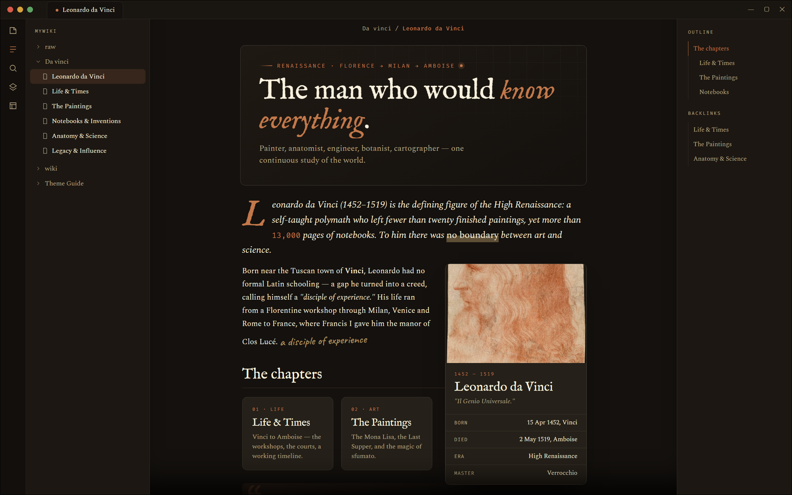

<div align="center">

# ⌖ Atelier

### An excavation journal for your notes.

*A documentary-editorial Obsidian theme — aged parchment & deep excavation dark, a single copper accent, and the antiquarian elegance of **IM Fell English**, **Spectral**, and **Caveat** marginalia.*




</div>

---

> **What it is.** Atelier turns plain Markdown into something that reads like a printed monograph — hero banners, museum plates, ledger tables, illuminated quotes, infoboxes and handwritten margins — all from ordinary Obsidian callouts. One copper accent, two paper modes, zero plugins required for the look.

## ✦ Two papers

| | |
|---|---|
| **Parchment** *(light)* | Warm aged paper `#E8DFC8`, ink-brown text, copper rules. Daylight reading. |
| **Excavation** *(dark)* | Deep dig-site `#14110E`, bone-white text, lifted cards. The signature mode. |

Switch with Obsidian's normal light/dark toggle — the whole palette pivots on one set of `--at-*` tokens.

## ✦ What you get

- **A card system** — `hero · skill · section · step · profile · honor · channels`, composed in `> [!grid|colsN]`, reflowing on resize.
- **Editorial elements** — infoboxes, ledger/boxed tables, illuminated/gloss/tablet quotes, museum figure plates, ornamented dividers.
- **Margin annotations** — `seal · folio · marg` casts that drop the box and sit *in* the page, in Caveat handwriting.
- **26 emotion casts** — stamps, flags, tablets and tags for every semantic callout.
- **Inline typography** — `at-kicker · at-lead · at-display · at-stat · at-mark · at-badge` for magazine openers without a single plugin.
- **Style Settings** — accent, fonts, width, roundness, per-element default styles, and entrance animations, all from one panel.

## ✦ Install

**From Obsidian** *(once published)* — Settings → Appearance → Themes → **Manage** → search **Atelier**.

**Manually** — copy `manifest.json` + `theme.css` into `<vault>/.obsidian/themes/Atelier/`, then select **Atelier** under Settings → Appearance.

> Requires Obsidian **1.5.0+**. Install the **Style Settings** plugin to customise everything. Bundled Google Fonts (IM Fell English · Spectral · Fira Code · Caveat) need internet on first load — flip **"Use system fonts"** in Style Settings for offline/mobile.

## ✦ Sixty-second start

```markdown
> [!card|hero dark spanfull]
> ###### RENAISSANCE · FLORENCE → MILAN → AMBOISE
> # The man who would *know everything*.
> One continuous study of the whole world.

> [!grid|cols2]
>
>> [!card]
>> ###### 01 · LIFE
>> ### Life & Times
>> Vinci to Amboise — the workshops and the courts.
>
>> [!card]
>> ###### 02 · ART
>> ### The Paintings
>> The Mona Lisa, the Last Supper, and sfumato.

> [!quote|illum] Leonardo da Vinci
> Learning never exhausts the mind.
```

That's three of Atelier's elements. There are dozens more.

## ✦ The element cookbook

Every component, one file at a time, with copy-pasteable syntax — in **[`examples/`](examples/)**:

[Callouts](examples/01-callouts.md) · [Cards](examples/02-cards.md) · [Grids & Columns](examples/03-grids-and-columns.md) · [Infobox](examples/04-infobox.md) · [Tables](examples/05-tables.md) · [Code](examples/06-code.md) · [Quotes](examples/07-quotes.md) · [Figures](examples/08-figures.md) · [Dividers](examples/09-dividers.md) · [Text utilities](examples/10-text-utilities.md) · [Emotion casts](examples/11-emotion-casts.md) · [Structural casts](examples/12-structural-casts.md)

## ✦ Customising

**Settings → Style Settings → Atelier** — accent & full palette, font dropdowns, note width, roundness, default card/infobox/tag/heading styles, body size, and entrance animations.

## ✦ Credits

- Aesthetic: 18th-century excavation journals & antiquarian print.
- Fonts: **IM Fell English**, **Spectral**, **Fira Code**, **Caveat** (Google Fonts).
- License: **[MIT](LICENSE)**.

<div align="center"><sub>Built for Obsidian · <code>--at-*</code> token system · made by <a href="https://github.com/bsbbera">Subhadip</a></sub></div>
